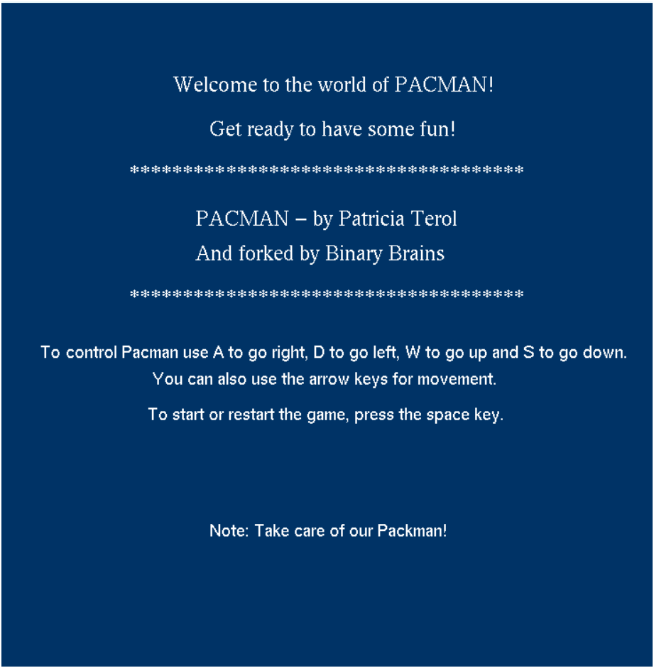
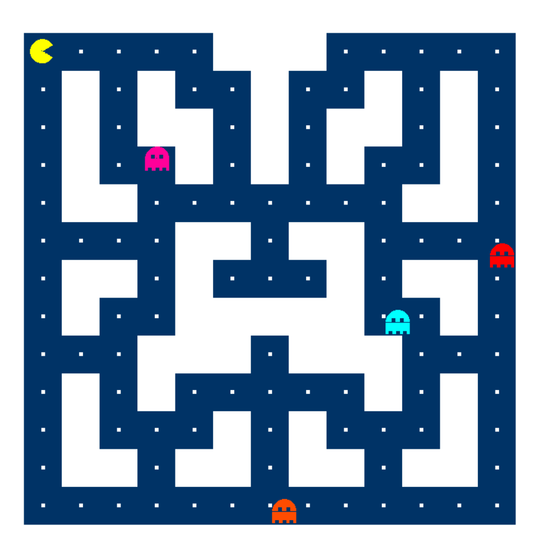
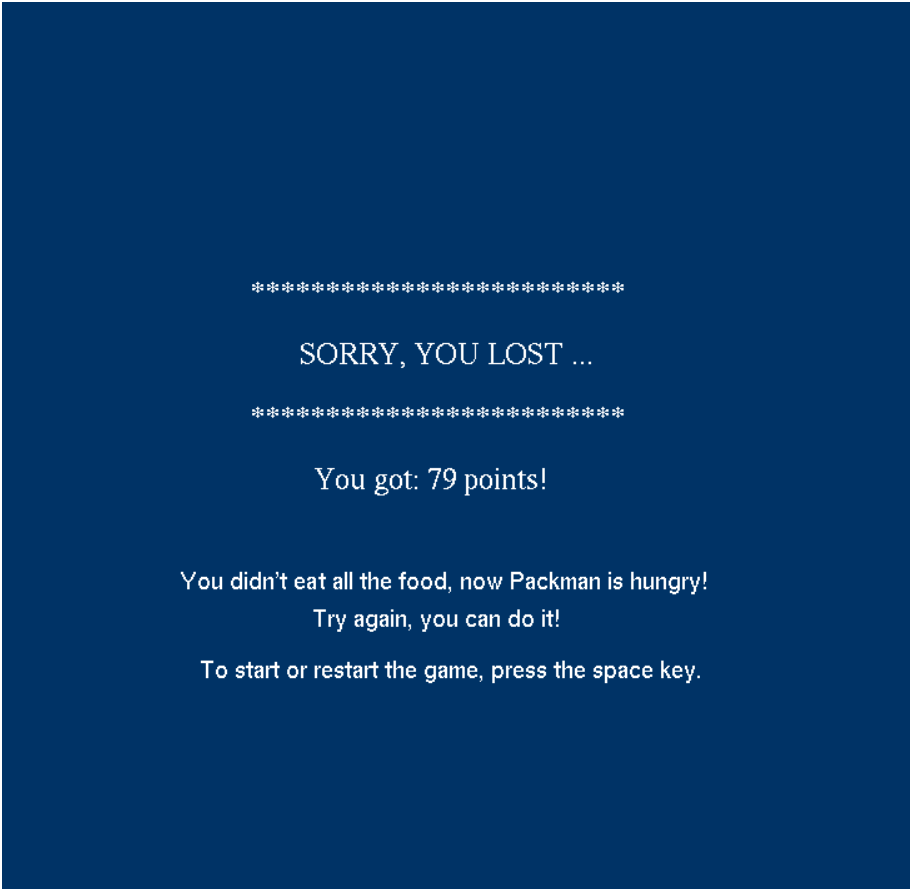

# 🟡 Pac-Man Clone (C++ & OpenGL)

A simple but fun Pac-Man style game built using **C++** and **OpenGL**, created as part of our CSE 2050 semester project. This game features a classic grid-based maze, collectible pellets, player-controlled Pac-Man, and randomly-moving monsters.

---

## 🎮 Features

 - Pac-Man character controlled by keyboard input.
 - Four monsters with randomized movement logic.
 - A maze made up of border walls and obstacles.
 - Collectible food points scattered across the map.
 - Collision detection between Pac-Man and food.
 - Visual rendering of game elements using OpenGL primitives.

---

## 📸 Screenshots

  
  

 

---

## 🧠 How It Works

- **Player**: Controlled using arrow keys (or `WASD`), moves smoothly on a 2D grid.
- **Monsters**: Use a basic AI that chooses a random valid direction every few frames (as shown in `updateMonster()` function).
- **Maze**: Hardcoded or loaded from a map file. `isValid(x, y)` checks if a tile is walkable.
- **Pellets**: When collected, increase score.

---

## 🛠️ Dependencies

Make sure you have the following installed (if not then click on the link):

- [C++ compiler](https://sourceforge.net/projects/mingw-w64/) (e.g., g++)
- [GLUT or FreeGLUT](https://www.transmissionzero.co.uk/software/freeglut-devel/)
